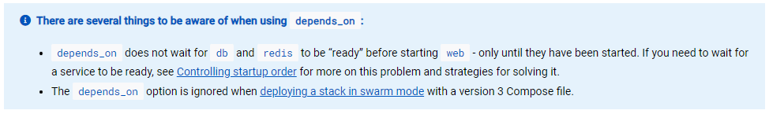
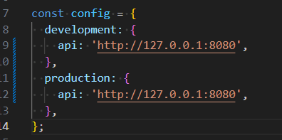
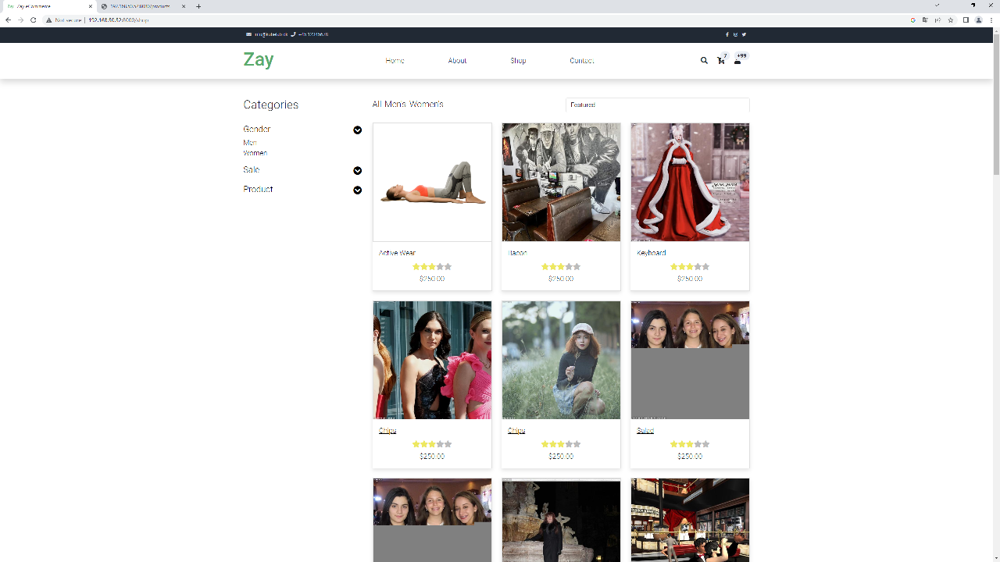

# this document is only intended as developers notes during the process of containerizing the given solution. It is incomplete. And a full report is given inside the 

docker pull node:20.3.0-slim

docker pull mariadb:10.6.14
# Problem statement

# Analysis - Getting started
I started out with the strategy to build the solution top to bottom, but reversed it because of the way the containers depend on each other, and because of the amount of challenges related to getting the frontend to run with production build
As i built the images needed, i also added configuration for them in the swarm config file ```PROD_stack.yml```

## Identifying needs
Looking at the solution, i identified the need for 2 different base images: mariadb and node, i went with the latest versions of each
After building the frontend for production, i realised that i also needed a reverse proxy like an nginx image to serve the static files built by vite

# Docker
Using docker it is possible to create a virtual environment that is independent of the underlying operating system, 

# Docker swarm
I decided to create the swarm from start ```docker swarm init``` and add containers to it as they were built.

## Deployment
The stack was deployed using ```docker stack deploy -c PROD_stack.yml exam``` naming my stack *exam*

## Updating services
Even though ```docker service update --force exam_frontend``` worked most of the time, i found it safer to use ```docker swarm rm exam``` for every change i made in the Dockerfile
It seemed to only reflect changes in the ```PROD_stack.yml```, and not changes in the underlying image. This could also be due to a problem with docker desktop

## Notes
When deploying a stack on a swarm, the ```depends_on``` parameter is also ignored, when using a compose-file of version 3 or above


|  |
|:--:|
| *source: https://docs.docker.com/compose/compose-file/compose-file-v3/* |


Note: Where ```docker compose up``` can build the images for you the ```docker stack deploy``` ignores build instructions

## Scaling

```docker service scale {servicename}={intances}```


## 


## Database
I could read the schema names, username, userpassword, and root password from the backend configuration in ./backend/config/database.js
i used those values for environment variables for the mariadb container

## Backend
The backend was straightforward, import baseimage, copy source, run npm install, and start

## Frontend
It turned out that the frontend needed a multistage build, and needed some additional configuration in ./src/main.js for running in production
More specifically adding url for backend api, see below image:


## Building the containers

# P

## Writing the .yml file

https://hub.docker.com/_/mariadb
https://hub.docker.com/_/nginx
https://v2.vuejs.org/v2/cookbook/dockerize-vuejs-app.html
https://docs.docker.com/build/building/multi-stage/





